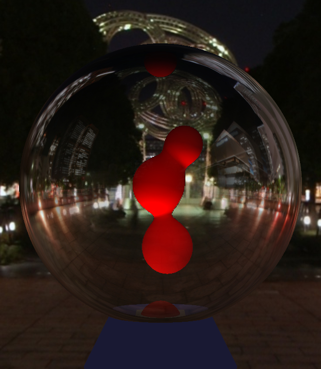

# Lava Lamp

This shader contains a lava lamp, although the logic runs in javascript.
No geometry is passed to the shader, only a few positions for the lava blobs are passed along.

## Controls

| Key | Action |
| --- | ------ |
|    W    | move up    |
|    A    | move left  |
|    S    | move down  |
|    D    | move right |

    

